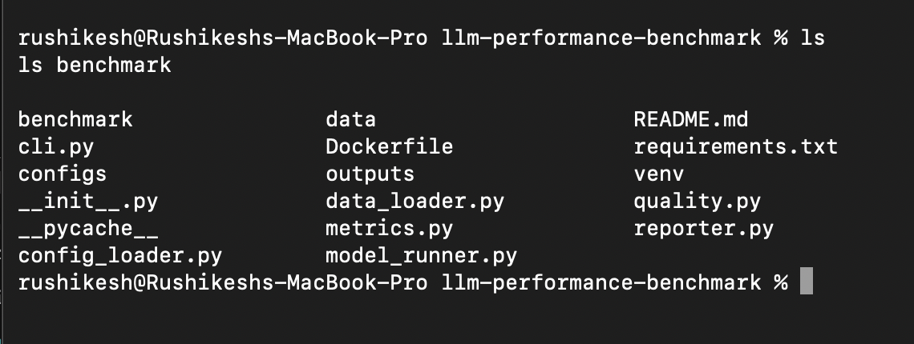
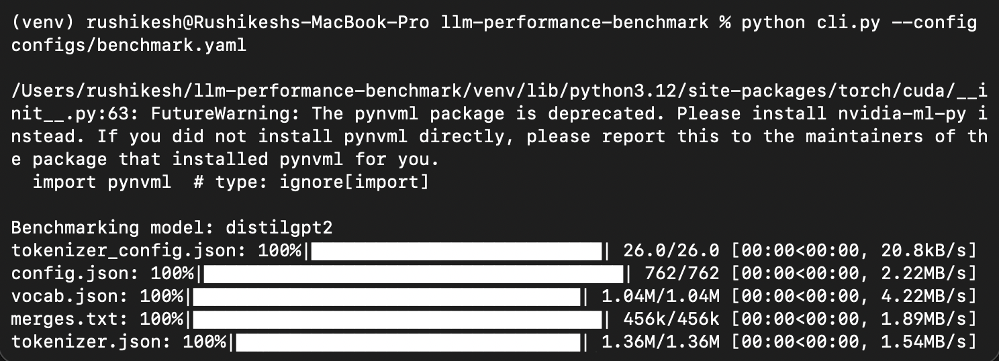
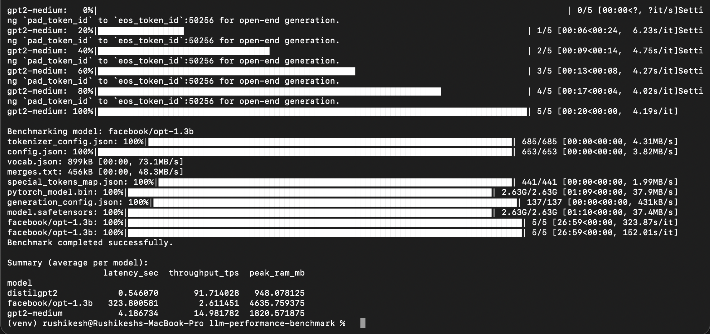
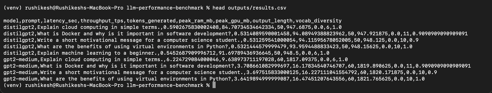
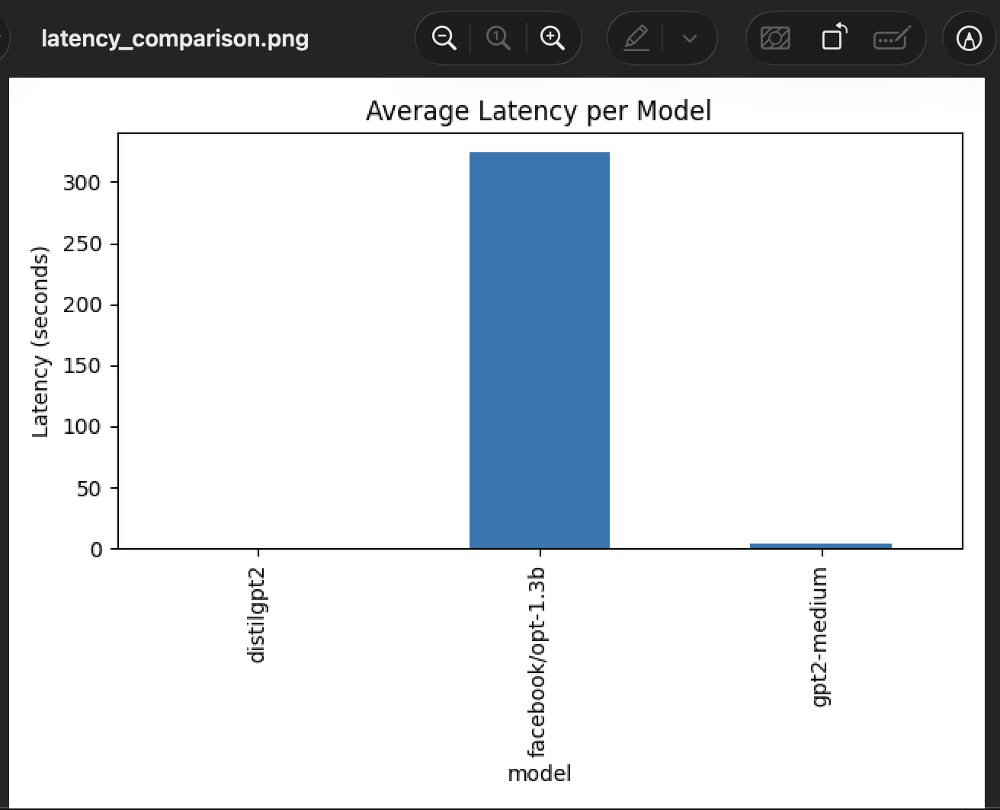
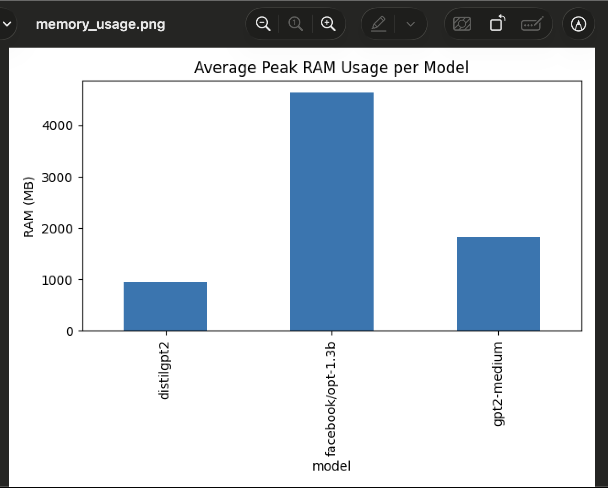

# LLM Performance Benchmarking Tool

This project is a command-line based benchmarking tool built to compare the performance of different open-source Large Language Models (LLMs). The main purpose of this tool is to understand how model size impacts inference latency, throughput, and memory usage when running models locally.

Instead of focusing only on how good the text output is, this project focuses more on system-level performance, which is an important factor when deploying LLMs in real-world applications.

---

## Objective

The primary objective of this project was to build a configurable and reusable benchmarking framework that can evaluate multiple LLMs under the same conditions. The idea was to move beyond theoretical comparisons and actually observe how different models behave during inference.

Through this project, I wanted to gain practical experience in:
- Running LLM inference using Hugging Face Transformers
- Measuring latency and throughput during generation
- Monitoring RAM and GPU usage (when available)
- Understanding how model size affects real-world performance
- Dockerizing an ML project for reproducibility

---

## Architecture and Design

The tool is designed in a modular way so that each responsibility is separated clearly. This makes the code easier to understand, debug, and extend.

High-level flow:
1. Load benchmark configuration from a YAML file
2. Load a dataset of prompts
3. Run inference for each prompt on each model
4. Collect performance and quality metrics
5. Save results to a CSV file
6. Generate visual reports from the collected results

Project structure:

llm-performance-benchmark/
├── benchmark/
│   ├── config_loader.py
│   ├── data_loader.py
│   ├── model_runner.py
│   ├── metrics.py
│   ├── quality.py
│   └── reporter.py
├── configs/
│   └── benchmark.yaml
├── data/
│   └── prompts.jsonl
├── outputs/
│   ├── results.csv
│   ├── latency_comparison.png
│   └── memory_usage.png
├── cli.py
├── Dockerfile
├── requirements.txt
└── README.md

---

## Models Benchmarked

The following open-source models from Hugging Face were benchmarked:

- distilgpt2  
  A very small and fast model used as a baseline.

- gpt2-medium  
  A medium-sized model that provides a noticeable jump in quality and resource usage.

- facebook/opt-1.3b  
  A larger model that clearly demonstrates the cost of scaling model size on CPU-only systems.

These models were chosen to represent different size categories and to observe how performance scales as model size increases.

---

## Metrics Collected

### Performance Metrics
- Inference Latency (seconds)
- Throughput (tokens per second)
- Peak RAM Usage (MB)
- Peak GPU Memory Usage (when GPU is available)

### Quality Metrics
- Output Length
- Vocabulary Diversity

The quality metrics are intentionally simple to keep the benchmarking lightweight and model-agnostic.

---

## Benchmark Results and Analysis

The benchmark was executed on a CPU-only environment. Below is a summary of the average results per model:

| Model | Avg Latency (sec) | Throughput (tokens/sec) | Peak RAM (MB) |
|------|------------------|--------------------------|---------------|
| distilgpt2 | ~0.55 | ~91.7 | ~948 |
| gpt2-medium | ~4.18 | ~15.0 | ~1820 |
| opt-1.3b | ~323.8 | ~2.6 | ~4636 |

Observations:
- Latency increases significantly with model size
- Throughput decreases as models become larger
- Memory usage grows rapidly for larger models
- First-token generation time dominates inference latency on CPU

---

## Visualizations

The following plots were generated from the benchmark results:
- Average Latency Comparison
- Average Peak Memory Usage

These visualizations help in understanding performance differences at a glance.

---

## Project Walkthrough (Screenshots)

### Project Structure
This shows the modular layout of the project and how responsibilities are separated.

### Running the Benchmark
CLI execution using the configuration file.

### Benchmark Summary Output
Final averaged metrics after benchmarking all models.

### Results Stored in CSV
All raw metrics are persisted for later analysis and visualization.

### Latency Comparison
Average inference latency comparison across models.

### Memory Usage Comparison
Peak RAM usage comparison across models.

---

## How to Run (Local)

Setup:
python3 -m venv venv
source venv/bin/activate
pip install -r requirements.txt

Run Benchmark:
python cli.py --config configs/benchmark.yaml

Results will be saved to outputs/results.csv.

---

## How to Run (Docker)

Build Image:
docker build -t llm-benchmark .

Run Container:
docker run --rm \
  -v $(pwd)/configs:/app/configs \
  -v $(pwd)/data:/app/data \
  -v $(pwd)/outputs:/app/outputs \
  llm-benchmark --config configs/benchmark.yaml

Models are downloaded at runtime to keep the Docker image lightweight.

---

## Limitations and Learnings

- Benchmarks were run on CPU-only hardware
- Large models have very high first-token latency
- Disk usage increases temporarily due to model downloads
- Hardware constraints strongly affect model choice

---

## Future Improvements

- Add GPU benchmarking
- Support batch inference
- Include advanced quality metrics
- Add experiment logging

---

## Conclusion

This project helped me understand the real-world performance trade-offs involved in running large language models and the importance of benchmarking before deployment.
